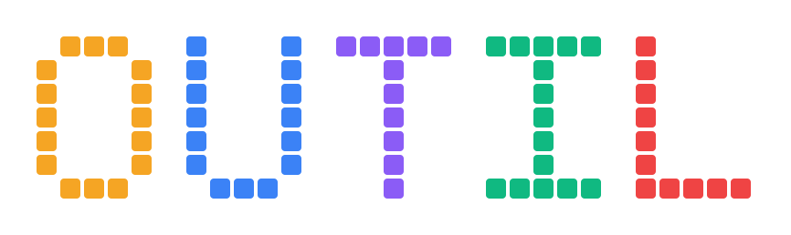
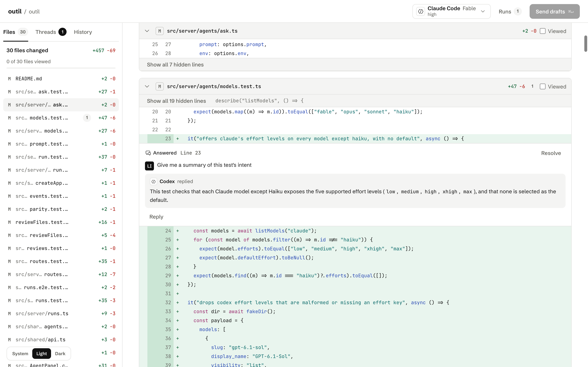
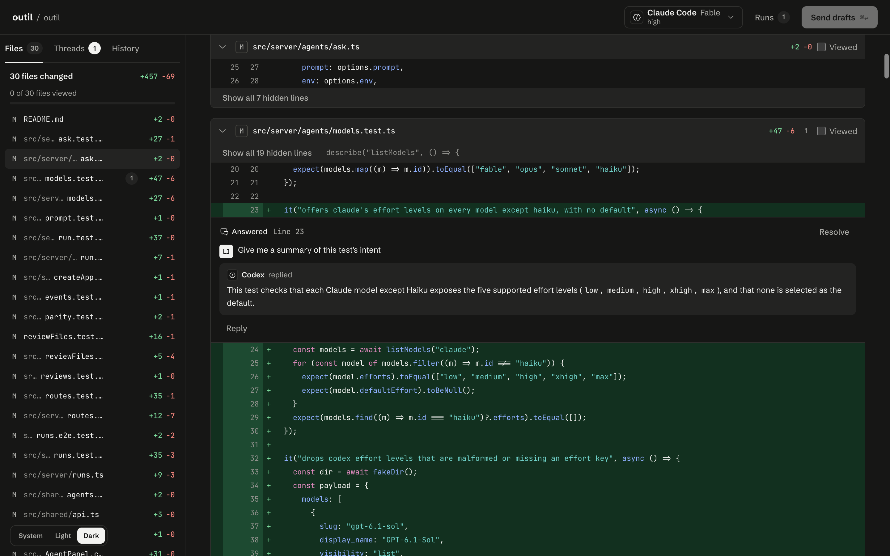
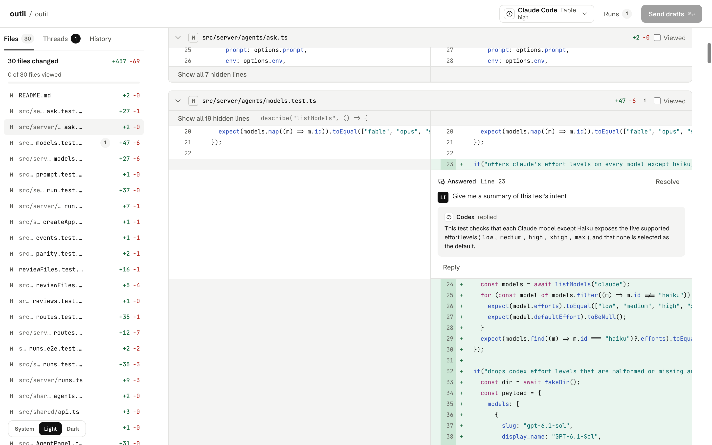
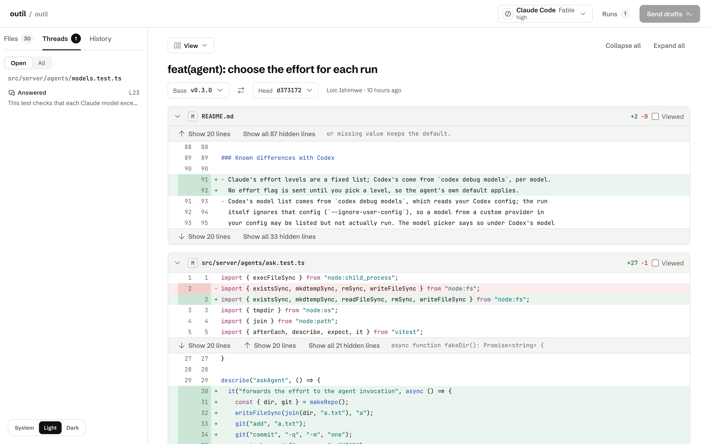
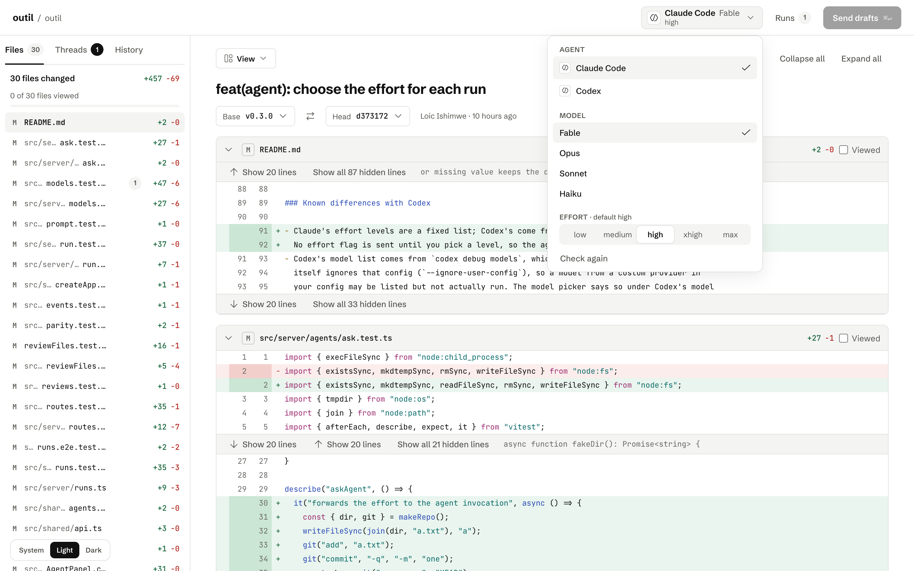

<p align="center">
  
</p>

<p align="center">
  <a href="https://www.npmjs.com/package/@odeloic/review"></a>
  <a href="https://github.com/odeloic/outil/actions/workflows/release.yml"></a>
  
  <a href="LICENSE"></a>
</p>

# @odeloic/review

An opinionated code review tool that uses your installed coding agents to read your code diffs and give feedback. Browse commits, compare branches, leave comments, and discuss changes with an agent from a local web interface.

This tool does not process any information outside of what's already processed by your coding agent.

<p align="center">
  
</p>

## Screenshots

| Dark | Split diff |
| --- | --- |
|  |  |

| Threads | Agent, model and effort |
| --- | --- |
|  |  |

## Quick start

From inside a Git repository (or one of its subdirectories), run:

```sh
npx @odeloic/review
```

You can review a specific commit, branch, or tag, or compare two refs:

```sh
npx @odeloic/review a1b2c3d
npx @odeloic/review main feature
```

The review opens at `http://127.0.0.1:4747`. If that port is busy, the tool selects and prints another one. Press Ctrl+C to stop it.

Options:

- `--port <number>` sets the preferred port (default: `4747`).
- `--no-open` prints the address without opening a browser.
- `-h, --help` and `-v, --version` show help and version information.

## Requirements

- Node.js 24 or newer
- Git
- Claude Code or Codex installed and signed in to request agent feedback

## Coding agents

The tool currently supports Claude Code and Codex. Install and sign in to either agent to use agent feedback. Support for additional agents, along with documentation for adding an agent, is a work in progress.

- [Claude Code](https://www.npmjs.com/package/@anthropic-ai/claude-code): `npm install -g @anthropic-ai/claude-code`, then `claude auth login`.
- [Codex](https://www.npmjs.com/package/@openai/codex): `npm install -g @openai/codex`, then `codex login`.

Agent feedback is based on a temporary snapshot of the reviewed commit. The agent cannot edit your repository or see uncommitted changes.

## Data and privacy

Review comments, agent replies, and resolved state are saved as JSON files in `.git/outil/reviews/` in the reviewed repository’s Git directory. Git worktrees share this data. It stays local and is not included in repository history or shown by `git status`.

To remove saved reviews, delete the `outil` folder inside `.git`. For a worktree, delete it from the common Git directory shown by `git rev-parse --git-common-dir`.

## FAQ

### Why does an agent appear unavailable?

Install the agent and sign in, then open the agent picker in the top bar. It shows setup guidance when an agent is not ready.

### Can I change the agent timeout?

Yes. Set `OUTIL_AGENT_TIMEOUT_MS` to a positive number of milliseconds. The default is 10 minutes.

## Development

```sh
pnpm install
pnpm dev
pnpm test
pnpm build
```

## Attribution

Icons are [Codicons](https://github.com/microsoft/vscode-codicons) by Microsoft, licensed under [CC-BY-4.0](https://creativecommons.org/licenses/by/4.0/).
